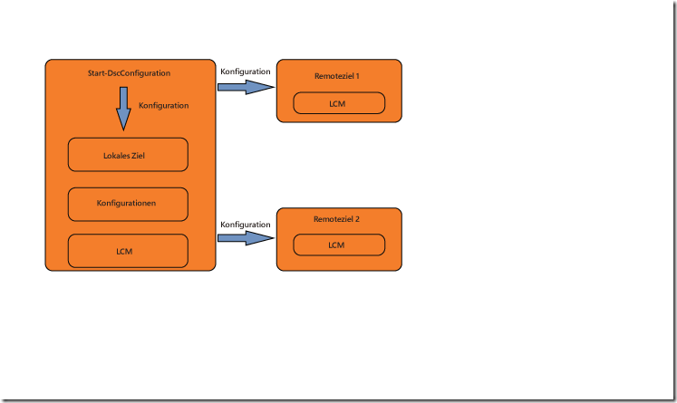
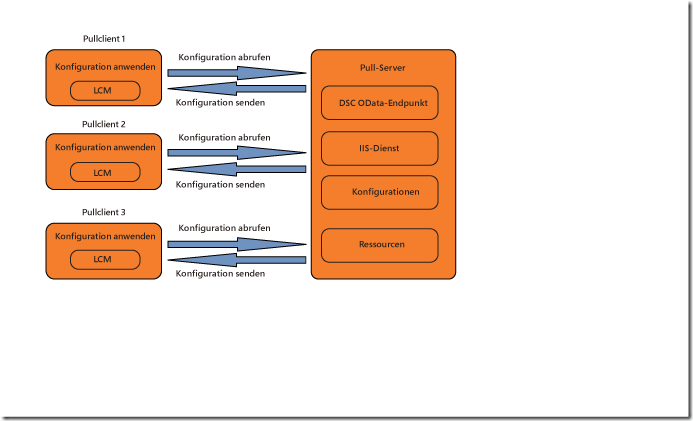

# Inkraftsetzung von Konfigurationen

>Gilt für: Windows PowerShell 4.0, Windows PowerShell 5.0

Es gibt zwei Möglichkeiten, PowerShell DSC-Konfigurationen (Desired State Configuration) anzuwenden: Push- und Pullmodus.

## Pushmodus

Der Pushmodus bezieht sich auf einen Benutzer, der eine Konfiguration durch Aufrufen des Cmdlets [Start-DscConfiguration](https://technet.microsoft.com/en-us/library/dn521623.aspx) aktiv auf einen Zielknoten anwendet.

Nach dem Erstellen und Kompilieren einer Konfiguration können Sie sie im Pushmodus anwenden, indem Sie das Cmdlet [Start-DscConfiguration](https://technet.microsoft.com/en-us/library/dn521623.aspx) aufrufen und den Parameter „-Path“ des Cmdlets auf den Pfad festlegen, in dem sich die MOF-Konfigurationsdatei befindet. Wenn sich die MOF-Konfigurationsdatei z. B. in `C:\DSC\Configurations\localhost.mof` befindet, wenden Sie sie mit dem folgenden Befehl auf den lokalen Computer an:
`Start-DscConfiguration -Path 'C:\DSC\Configurations'`

> __Hinweis__: DSC führt eine Konfiguration standardmäßig als Hintergrundauftrag aus. Um die Konfiguration interaktiv auszuführen, rufen Sie das Cmdlet [Start-DscConfiguration](https://technet.microsoft.com/en-us/library/dn521623.aspx) mit dem __-Wait__-Parameter auf.

Cloudbereitstellungsmodule nutzen innerhalb einer umfassenderen Bereitstellungslösung meist den Pullmodus.  Microsoft Azure bietet z. B. eine [DSC-Erweiterung](https://azure.microsoft.com/en-us/documentation/articles/virtual-machines-extensions-features/) für virtuelle Computer.  Diese bietet eine Option zum Einbeziehen eines Konfigurationsskripts und aller erforderlichen DSC-Module in eine Archivdatei, die in einem virtuellen Computer im Rahmen der Bereitstellung extrahiert und ausgeführt wird.  

## Pullmodus

Im Pullmodus werden Pullclients so konfiguriert, dass sie ihre Konfigurationen des gewünschten Zustands von einem Remotepullserver erhalten. Der Pullserver muss so eingerichtet werden, dass er den DSC-Dienst hostet und mit den Konfigurationen und Ressourcen versehen wird, die von den Pullclients benötigt werden.
Jeder der Pullclients weist einen geplanten Task auf, der für die Konfiguration auf dem Knoten eine regelmäßige Kompatibilitätsprüfung durchführt. Wenn das Ereignis erstmals ausgeführt wird, überprüft der lokale Konfigurations-Manager (LCM) auf dem Pullclient die Konfiguration. Wenn der Pullclient wie gewünscht konfiguriert ist, geschieht nichts. Andernfalls stellt der LCM an den Pullserver eine Anforderung zum Abrufen einer gegebenen Konfiguration. Wenn diese Konfiguration auf dem Pullserver vorhanden ist und anfängliche Überprüfungen besteht, wird die Konfiguration auf den Pullclient übertragen, auf dem sie vom LCM ausgeführt wird.

Weitere Informationen zum Bereitstellen eines lokalen DSC-Pullservers finden Sie im Handbuch zur Planung und Konfiguration von DSC-Pullservern.

Wenn Sie lieber einen Onlinedienst zum Hosten von Pullserverfunktionen nutzen möchten, sehen Sie sich den Dienst [Azure Automation DSC](https://azure.microsoft.com/en-us/documentation/articles/automation-dsc-overview/) an.

In den folgenden Themen wird erläutert, wie Pullserver und -clients eingerichtet werden:

- [Einrichten eines Webpullservers](pullServer.md)
- [Einrichten eines SMB-Pullservers](pullServerSMB.md)
- [Konfigurieren eines Pullclients](pullClientConfigID.md)<!--HONumber=Feb16_HO4-->
