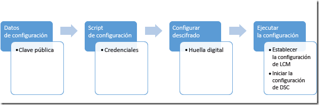

# <a name="securing-the-mof-file"></a><span data-ttu-id="5e2f2-103">Schützen der MOF-Datei</span><span class="sxs-lookup"><span data-stu-id="5e2f2-103">Securing the MOF File</span></span>

><span data-ttu-id="5e2f2-104">Gilt für: Windows PowerShell 4.0, Windows PowerShell 5.0</span><span class="sxs-lookup"><span data-stu-id="5e2f2-104">Applies To: Windows PowerShell 4.0, Windows PowerShell 5.0</span></span>

<span data-ttu-id="5e2f2-105">DSC verwaltet die Konfiguration von Serverknoten durch Anwenden der in einer MOF-Datei gespeicherten Informationen; die Implementierung des gewünschten Endzustands übernimmt der lokale Konfigurations-Manager (LCM).</span><span class="sxs-lookup"><span data-stu-id="5e2f2-105">DSC manages the configuration of server nodes by applying information stored in a MOF file, where the Local Configuration Manager (LCM) implements the desired end state.</span></span>
<span data-ttu-id="5e2f2-106">Da diese Datei die Details der Konfiguration enthält, muss sie geschützt werden.</span><span class="sxs-lookup"><span data-stu-id="5e2f2-106">Because this file contains the details of the configuration, it’s important to keep it secure.</span></span>
<span data-ttu-id="5e2f2-107">In diesem Thema wird beschrieben, auf welche Weise sichergestellt werden kann, dass die Datei auf dem Zielknoten verschlüsselt wurde.</span><span class="sxs-lookup"><span data-stu-id="5e2f2-107">This topic describes how to ensure the target node has encrypted the file.</span></span>

<span data-ttu-id="5e2f2-108">Seit PowerShell-Version 5.0 ist die gesamte MOF-Datei standardmäßig verschlüsselt, wenn sie mithilfe des Cmdlets **Start-DSCConfiguration** auf den Knoten angewendet wird.</span><span class="sxs-lookup"><span data-stu-id="5e2f2-108">Beginning with PowerShell version 5.0, the entire MOF file is encrypted by default when it is applied to the node using the **Start-DSCConfiguration** cmdlet.</span></span>
<span data-ttu-id="5e2f2-109">Das in diesem Artikel beschriebene Verfahren ist nur erforderlich, wenn eine Lösung unter Verwendung des Pulldienstprotokolls implementiert wird und keine Zertifikate verwaltet werden, um sicherzustellen, dass vom Zielknoten heruntergeladene Konfigurationen vom System vor der Anwendung entschlüsselt und gelesen werden können (betrifft beispielsweise den in Windows Server verfügbaren Pulldienst).</span><span class="sxs-lookup"><span data-stu-id="5e2f2-109">The process described in this article is required only when implementing a solution using the pull service protocol if certificates are not managed, to ensure configurations downloaded by the target node can be decrypted and read by the system before they are applied (for example, the pull service available in Windows Server).</span></span>
<span data-ttu-id="5e2f2-110">Für bei [Azure Automation DSC](https://docs.microsoft.com/en-us/azure/automation/automation-dsc-overview) registrierte Knoten werden ohne anfallenden administrativen Mehraufwand automatisch Zertifikate installiert und verwaltet.</span><span class="sxs-lookup"><span data-stu-id="5e2f2-110">Nodes registered to [Azure Automation DSC](https://docs.microsoft.com/en-us/azure/automation/automation-dsc-overview) will automatically have certificates installed and managed by the service with no administrative overhead required.</span></span>

><span data-ttu-id="5e2f2-111">**Hinweis:** In diesem Thema werden für die Verschlüsselung verwendete Zertifikate behandelt.</span><span class="sxs-lookup"><span data-stu-id="5e2f2-111">**Note:** This topic discusses certificates used for encryption.</span></span>
><span data-ttu-id="5e2f2-112">Für die Verschlüsselung ist ein selbst signiertes Zertifikat ausreichend, da der private Schlüssel immer geheim ist und die Verschlüsselung die Vertrauenswürdigkeit des Dokuments nicht impliziert.</span><span class="sxs-lookup"><span data-stu-id="5e2f2-112">For encryption, a self-signed certificate is sufficient, because the private key is always kept secret and encryption does not imply trust of the document.</span></span>
><span data-ttu-id="5e2f2-113">Selbstsignierte Zertifikate sollten *nicht* zu Authentifizierungszwecken verwendet werden.</span><span class="sxs-lookup"><span data-stu-id="5e2f2-113">Self-signed certificates should *not* be used for authentication purposes.</span></span>
><span data-ttu-id="5e2f2-114">Zum Zweck der Authentifizierung Sie sollten Sie ein Zertifikat von einer vertrauenswürdigen Zertifizierungsstelle verwenden.</span><span class="sxs-lookup"><span data-stu-id="5e2f2-114">You should use a certificate from a trusted Certification Authority (CA) for any authentication purposes.</span></span>

## <a name="prerequisites"></a><span data-ttu-id="5e2f2-115">Voraussetzungen</span><span class="sxs-lookup"><span data-stu-id="5e2f2-115">Prerequisites</span></span>

<span data-ttu-id="5e2f2-116">Stellen Sie sicher, dass Folgendes zutrifft, um die Anmeldeinformationen sicher zu verschlüsseln, die zum Schutz einer DSC-Konfiguration dienen:</span><span class="sxs-lookup"><span data-stu-id="5e2f2-116">To successfully encrypt the credentials used to secure a DSC configuration, make sure you have the following:</span></span>

* <span data-ttu-id="5e2f2-117">**Möglichkeiten zum Ausstellen und Verteilen von Zertifikaten**.</span><span class="sxs-lookup"><span data-stu-id="5e2f2-117">**Some means of issuing and distributing certificates**.</span></span> <span data-ttu-id="5e2f2-118">In diesem Thema und seinen Beispielen wird davon ausgegangen, dass Sie eine Active Directory-Zertifizierungsstelle verwenden.</span><span class="sxs-lookup"><span data-stu-id="5e2f2-118">This topic and its examples assume you are using Active Directory Certification Authority.</span></span> <span data-ttu-id="5e2f2-119">Weitere Informationen zu Active Directory-Zertifikatdiensten finden Sie unter [Übersicht über Active Directory-Zertifikatdienste](https://technet.microsoft.com/library/hh831740.aspx) und [Active Directory-Zertifikatdienste in Windows Server 2008](https://technet.microsoft.com/windowsserver/dd448615.aspx).</span><span class="sxs-lookup"><span data-stu-id="5e2f2-119">For more background information on Active Directory Certificate Services, see [Active Directory Certificate Services Overview](https://technet.microsoft.com/library/hh831740.aspx) and [Active Directory Certificate Services in Windows Server 2008](https://technet.microsoft.com/windowsserver/dd448615.aspx).</span></span>
* <span data-ttu-id="5e2f2-120">**Administratorzugriff auf den Zielknoten oder Knoten**.</span><span class="sxs-lookup"><span data-stu-id="5e2f2-120">**Administrative access to the target node or nodes**.</span></span>
* <span data-ttu-id="5e2f2-121">**Jeder Zielknoten hat ein verschlüsselungsfähiges Zertifikat, das in seinem persönlichen Speicher gespeichert ist**.</span><span class="sxs-lookup"><span data-stu-id="5e2f2-121">**Each target node has an encryption-capable certificate saved its Personal Store**.</span></span> <span data-ttu-id="5e2f2-122">In Windows PowerShell ist der Pfad zum Speicher „Cert: \LocalMachine\My“.</span><span class="sxs-lookup"><span data-stu-id="5e2f2-122">In Windows PowerShell, the path to the store is Cert:\LocalMachine\My.</span></span> <span data-ttu-id="5e2f2-123">In den Beispielen in diesem Thema verwenden Sie die Vorlage „Arbeitsstationsauthentifizierung“, die Sie (zusammen mit anderen Zertifikatvorlagen) unter [Standardzertifikatvorlagen](https://technet.microsoft.com/library/cc740061(v=WS.10).aspx) finden.</span><span class="sxs-lookup"><span data-stu-id="5e2f2-123">The examples in this topic use the “workstation authentication” template, which you can find (along with other certificate templates) at [Default Certificate Templates](https://technet.microsoft.com/library/cc740061(v=WS.10).aspx).</span></span>
* <span data-ttu-id="5e2f2-124">Wenn Sie diese Konfiguration auf einem anderen Computer als dem Zielknoten ausführen, **exportieren Sie den öffentlichen Schlüssel des Zertifikats**, und importieren Sie ihn anschließend auf den Computer, auf dem Sie die Konfiguration ausführen.</span><span class="sxs-lookup"><span data-stu-id="5e2f2-124">If you will be running this configuration on a computer other than the target node, **export the public key of the certificate**, and then import it to the computer you will run the configuration from.</span></span> <span data-ttu-id="5e2f2-125">Stellen Sie sicher, dass Sie nur den **öffentlichen** Schlüssel exportieren. Halten Sie den privaten Schlüssel geschützt.</span><span class="sxs-lookup"><span data-stu-id="5e2f2-125">Make sure that you export only the **public** key; keep the private key secure.</span></span>

## <a name="overall-process"></a><span data-ttu-id="5e2f2-126">Allgemeiner Prozess</span><span class="sxs-lookup"><span data-stu-id="5e2f2-126">Overall process</span></span>

 1. <span data-ttu-id="5e2f2-127">Richten Sie die Zertifikate, Schlüssel und Fingerabdrücke ein, und stellen Sie sicher, dass jeder Zielknoten über Kopien des Zertifikats verfügt, und dass sich der öffentliche Schlüssel und Fingerabdruck auf dem Konfigurationscomputer befinden.</span><span class="sxs-lookup"><span data-stu-id="5e2f2-127">Set up the certificates, keys, and thumbprints, making sure that each target node has copies of the certificate and the configuration computer has the public key and thumbprint.</span></span>
 2. <span data-ttu-id="5e2f2-128">Erstellen Sie einen „Configuration“-Datenblock, der den Pfad und Fingerabdruck des öffentlichen Schlüssels enthält.</span><span class="sxs-lookup"><span data-stu-id="5e2f2-128">Create a configuration data block that contains the path and thumbprint of the public key.</span></span>
 3. <span data-ttu-id="5e2f2-129">Erstellen Sie ein Konfigurationsskript, das die gewünschte Konfiguration für den Zielknoten definiert. Richten Sie die Entschlüsselung auf den Zielknoten ein, indem Sie den lokalen Konfigurations-Manager anweisen, die Konfigurationsdaten mithilfe des Zertifikats und Fingerabdrucks zu entschlüsseln.</span><span class="sxs-lookup"><span data-stu-id="5e2f2-129">Create a configuration script that defines your desired configuration for the target node and sets up decryption on the target nodes by commanding the Local Configuration manager to decrypt the configuration data using the certificate and its thumbprint.</span></span>
 4. <span data-ttu-id="5e2f2-130">Führen Sie die Konfiguration aus, woraufhin die Einstellungen des lokalen Konfigurations-Managers festgelegt werden und die DSC-Konfiguration gestartet wird.</span><span class="sxs-lookup"><span data-stu-id="5e2f2-130">Run the configuration, which will set the Local Configuration Manager settings and start the DSC configuration.</span></span>



## <a name="certificate-requirements"></a><span data-ttu-id="5e2f2-132">Zertifikatanforderungen</span><span class="sxs-lookup"><span data-stu-id="5e2f2-132">Certificate Requirements</span></span>

<span data-ttu-id="5e2f2-133">Zum Aktivieren der Verschlüsselung der Anmeldeinformationen muss auf dem _Zielknoten_ ein Zertifikat für öffentliche Schlüssel verfügbar sein, dem der zum Erstellen der DSC-Konfiguration verwendete Computer **vertraut**.</span><span class="sxs-lookup"><span data-stu-id="5e2f2-133">To enact credential encryption, a public key certificate must be available on the _Target Node_ that is **trusted** by the computer being used to author the DSC configuration.</span></span>
<span data-ttu-id="5e2f2-134">Dieses Zertifikat für öffentliche Schlüssel muss bestimmte Anforderungen erfüllen, damit es für die Verschlüsselung der DSC-Anmeldeinformationen verwendet werden kann:</span><span class="sxs-lookup"><span data-stu-id="5e2f2-134">This public key certificate has specific requirements for it to be used for DSC credential encryption:</span></span>
 1. <span data-ttu-id="5e2f2-135">**Schlüsselverwendung**:</span><span class="sxs-lookup"><span data-stu-id="5e2f2-135">**Key Usage**:</span></span>
   - <span data-ttu-id="5e2f2-136">Muss enthalten: „KeyEncipherment“ und „DataEncipherment“.</span><span class="sxs-lookup"><span data-stu-id="5e2f2-136">Must contain: 'KeyEncipherment' and 'DataEncipherment'.</span></span>
   - <span data-ttu-id="5e2f2-137">Sollte _nicht_ enthalten: „Digitale Signatur“.</span><span class="sxs-lookup"><span data-stu-id="5e2f2-137">Should _not_ contain: 'Digital Signature'.</span></span>
 2. <span data-ttu-id="5e2f2-138">**Erweiterte Schlüsselverwendung**:</span><span class="sxs-lookup"><span data-stu-id="5e2f2-138">**Enhanced Key Usage**:</span></span>
   - <span data-ttu-id="5e2f2-139">Muss enthalten: Dokumentenverschlüsselung (1.3.6.1.4.1.311.80.1).</span><span class="sxs-lookup"><span data-stu-id="5e2f2-139">Must contain: Document Encryption (1.3.6.1.4.1.311.80.1).</span></span>
   - <span data-ttu-id="5e2f2-140">Sollte _nicht_ enthalten: Clientauthentifizierung (1.3.6.1.5.5.7.3.2) und Serverauthentifizierung (1.3.6.1.5.5.7.3.1).</span><span class="sxs-lookup"><span data-stu-id="5e2f2-140">Should _not_ contain: Client Authentication (1.3.6.1.5.5.7.3.2) and Server Authentication (1.3.6.1.5.5.7.3.1).</span></span>
 3. <span data-ttu-id="5e2f2-141">Der private Schlüssel für das Zertifikat ist auf dem \*Zielknoten_ verfügbar.</span><span class="sxs-lookup"><span data-stu-id="5e2f2-141">The Private Key for the certificate is available on the \*Target Node_.</span></span>
 4. <span data-ttu-id="5e2f2-142">Der **Anbieter** für das Zertifikat muss „Microsoft RSA SChannel Cryptographic Provider“ sein.</span><span class="sxs-lookup"><span data-stu-id="5e2f2-142">The **Provider** for the certificate must be "Microsoft RSA SChannel Cryptographic Provider".</span></span>
 
><span data-ttu-id="5e2f2-143">**Empfohlene bewährte Methode:** Sie können ein Zertifikat, das die Schlüsselverwendung „Digitale Signatur“ oder eine der „Authentifizierungs-EKU enthält, zwar verwenden, dadurch kann der die Verschlüsselungsschlüssel allerdings leichter missbraucht werden und ist anfälliger für Angriffe.</span><span class="sxs-lookup"><span data-stu-id="5e2f2-143">**Recommended Best Practice:** Although you can use a certificate with containing a Key Usage of 'Digital Signature' or one of the Authentication EKU's, this will enable the encryption key to be more easily misused and vulnerable to attack.</span></span> <span data-ttu-id="5e2f2-144">Es empfiehlt sich daher, ein Zertifikat ohne diese Schlüsselverwendung und EKUs zu verwenden, das speziell zum Sichern von DSC-Anmeldeinformationen erstellt wurde.</span><span class="sxs-lookup"><span data-stu-id="5e2f2-144">So it is best practice to use a certificate created specifically for the purpose of securing DSC credentials that omits these Key Usage and EKUs.</span></span>
  
<span data-ttu-id="5e2f2-145">Alle vorhandenen Zertifikate auf dem _Zielknoten_, die diese Kriterien erfüllen, können zum Absichern von DSC-Anmeldeinformationen verwendet werden.</span><span class="sxs-lookup"><span data-stu-id="5e2f2-145">Any existing certificate on the _Target Node_ that meets these criteria can be used to secure DSC credentials.</span></span>

## <a name="certificate-creation"></a><span data-ttu-id="5e2f2-146">Erstellen von Zertifikaten</span><span class="sxs-lookup"><span data-stu-id="5e2f2-146">Certificate creation</span></span>

<span data-ttu-id="5e2f2-147">Es gibt zwei Ansätze, die Sie ergreifen können, um das erforderliche Verschlüsselungszertifikat (Paar aus öffentlichem/privatem Schlüssel) zu erstellen und zu verwenden .</span><span class="sxs-lookup"><span data-stu-id="5e2f2-147">There are two approaches you can take to create and use the required Encryption Certificate (public-private key pair).</span></span>

1. <span data-ttu-id="5e2f2-148">Sie können es auf dem **Zielknoten** erstellen und nur den öffentlichen Schlüssel auf den **Erstellungsknoten** exportieren.</span><span class="sxs-lookup"><span data-stu-id="5e2f2-148">Create it on the **Target Node** and export just the public key to the **Authoring Node**</span></span>
2. <span data-ttu-id="5e2f2-149">Sie können es auf dem **Erstellungsknoten** erstellen und das gesamte Schlüsselpaar auf den **Zielknoten** exportieren.</span><span class="sxs-lookup"><span data-stu-id="5e2f2-149">Create it on the **Authoring Node** and export the entire key pair to the **Target Node**</span></span>

<span data-ttu-id="5e2f2-150">Empfohlen wird Methode 1, weil der im MOF zum Entschlüsseln von Anmeldeinformationen verwendete private Schlüssel immer auf dem Zielknoten verbleibt.</span><span class="sxs-lookup"><span data-stu-id="5e2f2-150">Method 1 is recommended because the private key used to decrypt credentials in the MOF stays on the Target Node at all times.</span></span>


### <a name="creating-the-certificate-on-the-target-node"></a><span data-ttu-id="5e2f2-151">Erstellen des Zertifikats auf dem Zielknoten</span><span class="sxs-lookup"><span data-stu-id="5e2f2-151">Creating the Certificate on the Target Node</span></span>

<span data-ttu-id="5e2f2-152">Der private Schlüssel muss geheim gehalten werden, weil er zum Entschlüsseln des MOF auf dem **Zielknoten** verwendet wird. Die einfachste Möglichkeit hierzu ist, das Zertifikat für private Schlüssel auf dem **Zielknoten** zu erstellen und das **Zertifikat für öffentliche Schlüssel** auf den Computer zu kopieren, der zum Erstellen der DSC-Konfiguration in einer MOF-Datei verwendet wird.</span><span class="sxs-lookup"><span data-stu-id="5e2f2-152">The private key must be kept secret, because is used to decrypt the MOF on the **Target Node** The easiest way to do that is to create the private key certificate on the **Target Node**, and copy the **public key certificate** to the computer being used to author the DSC configuration into a MOF file.</span></span>
<span data-ttu-id="5e2f2-153">Im folgenden Beispiel</span><span class="sxs-lookup"><span data-stu-id="5e2f2-153">The following example:</span></span>
 1. <span data-ttu-id="5e2f2-154">ein Zertifikat auf dem **Zielknoten** erstellt.</span><span class="sxs-lookup"><span data-stu-id="5e2f2-154">creates a certificate on the **Target node**</span></span>
 2. <span data-ttu-id="5e2f2-155">das Zertifikat für öffentliche Schlüssel auf den **Zielknoten** exportiert.</span><span class="sxs-lookup"><span data-stu-id="5e2f2-155">exports the public key certificate on the **Target node**.</span></span>
 3. <span data-ttu-id="5e2f2-156">das Zertifikat für öffentliche Schlüssel in den **my**-Zertifikatspeicher auf dem **Erstellungsknoten** importiert.</span><span class="sxs-lookup"><span data-stu-id="5e2f2-156">imports the public key certificate into the **my** certificate store on the **Authoring node**.</span></span>

#### <a name="on-the-target-node-create-and-export-the-certificate"></a><span data-ttu-id="5e2f2-157">Auf dem Zielknoten: Erstellen und Exportieren des Zertifikats</span><span class="sxs-lookup"><span data-stu-id="5e2f2-157">On the Target Node: create and export the certificate</span></span>
><span data-ttu-id="5e2f2-158">Zielknoten: Windows Server 2016 und Windows 10</span><span class="sxs-lookup"><span data-stu-id="5e2f2-158">Target Node: Windows Server 2016 and Windows 10</span></span>

```powershell
# note: These steps need to be performed in an Administrator PowerShell session
$cert = New-SelfSignedCertificate -Type DocumentEncryptionCertLegacyCsp -DnsName 'DscEncryptionCert' -HashAlgorithm SHA256
# export the public key certificate
$cert | Export-Certificate -FilePath "$env:temp\DscPublicKey.cer" -Force
```
<span data-ttu-id="5e2f2-159">Einmal exportiert, müsste ```DscPublicKey.cer``` auf den **Erstellungsknoten** kopiert werden.</span><span class="sxs-lookup"><span data-stu-id="5e2f2-159">Once exported, the ```DscPublicKey.cer``` would need to be copied to the **Authoring Node**.</span></span>

><span data-ttu-id="5e2f2-160">Zielknoten: Windows Server 2012 R2/Windows 8.1 und früher</span><span class="sxs-lookup"><span data-stu-id="5e2f2-160">Target Node: Windows Server 2012 R2/Windows 8.1 and earlier</span></span>

<span data-ttu-id="5e2f2-161">Da das Cmdlet „New-SelfSignedCertificate“ unter niedrigeren Windows-Betriebssystemen als Windows 10 und Windows Server 2016 nicht den Parameter **Typ** unterstützt, ist eine alternative Methode zum Erstellen dieses Zertifikats unter diesen Betriebssystemen erforderlich.</span><span class="sxs-lookup"><span data-stu-id="5e2f2-161">Because the New-SelfSignedCertificate cmdlet on Windows Operating Systems prior to Windows 10 and Windows Server 2016 do not support the **Type** parameter, an alternate method of creating this certificate is required on these operating systems.</span></span>
<span data-ttu-id="5e2f2-162">In diesem Fall können Sie ```makecert.exe``` oder ```certutil.exe``` zum Erstellen des Zertifikats verwenden.</span><span class="sxs-lookup"><span data-stu-id="5e2f2-162">In this case you can use ```makecert.exe``` or ```certutil.exe``` to create the certificate.</span></span>

<span data-ttu-id="5e2f2-163">Eine alternative Methode besteht darin, [das Skript „New-SelfSignedCertificateEx.ps1“ aus dem Microsoft Script Center](https://gallery.technet.microsoft.com/scriptcenter/Self-signed-certificate-5920a7c6) herunterzuladen und es stattdessen zum Erstellen des Zertifikats zu verwenden:</span><span class="sxs-lookup"><span data-stu-id="5e2f2-163">An alternate method is to [download the New-SelfSignedCertificateEx.ps1 script from Microsoft Script Center](https://gallery.technet.microsoft.com/scriptcenter/Self-signed-certificate-5920a7c6) and use it to create the certificate instead:</span></span>
```powershell
# note: These steps need to be performed in an Administrator PowerShell session
# and in the folder that contains New-SelfSignedCertificateEx.ps1
. .\New-SelfSignedCertificateEx.ps1
New-SelfsignedCertificateEx `
    -Subject "CN=${ENV:ComputerName}" `
    -EKU 'Document Encryption' `
    -KeyUsage 'KeyEncipherment, DataEncipherment' `
    -SAN ${ENV:ComputerName} `
    -FriendlyName 'DSC Credential Encryption certificate' `
    -Exportable `
    -StoreLocation 'LocalMachine' `
    -KeyLength 2048 `
    -ProviderName 'Microsoft Enhanced Cryptographic Provider v1.0' `
    -AlgorithmName 'RSA' `
    -SignatureAlgorithm 'SHA256'
# Locate the newly created certificate
$Cert = Get-ChildItem -Path cert:\LocalMachine\My `
    | Where-Object {
        ($_.FriendlyName -eq 'DSC Credential Encryption certificate') `
        -and ($_.Subject -eq "CN=${ENV:ComputerName}")
    } | Select-Object -First 1
# export the public key certificate
$cert | Export-Certificate -FilePath "$env:temp\DscPublicKey.cer" -Force
```
<span data-ttu-id="5e2f2-164">Einmal exportiert, müsste ```DscPublicKey.cer``` auf den **Erstellungsknoten** kopiert werden.</span><span class="sxs-lookup"><span data-stu-id="5e2f2-164">Once exported, the ```DscPublicKey.cer``` would need to be copied to the **Authoring Node**.</span></span>

#### <a name="on-the-authoring-node-import-the-certs-public-key"></a><span data-ttu-id="5e2f2-165">Auf dem Erstellungsknoten: Importieren des öffentlichen Schlüssels des Zertifikats</span><span class="sxs-lookup"><span data-stu-id="5e2f2-165">On the Authoring Node: import the cert’s public key</span></span>
```powershell
# Import to the my store
Import-Certificate -FilePath "$env:temp\DscPublicKey.cer" -CertStoreLocation Cert:\LocalMachine\My
```

### <a name="creating-the-certificate-on-the-authoring-node"></a><span data-ttu-id="5e2f2-166">Erstellen des Zertifikats auf dem Erstellungsknoten</span><span class="sxs-lookup"><span data-stu-id="5e2f2-166">Creating the Certificate on the Authoring Node</span></span>
<span data-ttu-id="5e2f2-167">Alternativ kann das Verschlüsselungszertifikat auf dem **Erstellungsknoten** erstellt, mit dem **privaten Schlüssel** als PFX-Datei exportiert und dann auf dem **Zielknoten** importiert werden.</span><span class="sxs-lookup"><span data-stu-id="5e2f2-167">Alternately, the encryption certificate can be created on the **Authoring Node**, exported with the **private key** as a PFX file and then imported on the **Target Node**.</span></span>
<span data-ttu-id="5e2f2-168">Dies ist die aktuelle Methode zur Implementierung der Verschlüsselung von DSC-Anmeldeinformationen unter _Nano Server_.</span><span class="sxs-lookup"><span data-stu-id="5e2f2-168">This is the current method for implementing DSC credential encryption on _Nano Server_.</span></span>
<span data-ttu-id="5e2f2-169">Obwohl die PFX-Datei mit einem Kennwort geschützt ist, sollte sie während der Übertragung gesichert werden.</span><span class="sxs-lookup"><span data-stu-id="5e2f2-169">Although the PFX is secured with a password it should be kept secure during transit.</span></span>
<span data-ttu-id="5e2f2-170">Im folgenden Beispiel</span><span class="sxs-lookup"><span data-stu-id="5e2f2-170">The following example:</span></span>
 1. <span data-ttu-id="5e2f2-171">wird ein Zertifikat auf dem **Erstellungsknoten** erstellt.</span><span class="sxs-lookup"><span data-stu-id="5e2f2-171">creates a certificate on the **Authoring node**.</span></span>
 2. <span data-ttu-id="5e2f2-172">wird das Zertifikat, einschließlich des privaten Schlüssels, auf den **Erstellungsknoten** exportiert.</span><span class="sxs-lookup"><span data-stu-id="5e2f2-172">exports the certificate including the private key on the **Authoring node**.</span></span>
 3. <span data-ttu-id="5e2f2-173">wird der private Schlüssel vom **Erstellungsknoten** entfernt, aber das Zertifikat für den öffentlichen Schlüssel im **my**-Speicher beibehalten.</span><span class="sxs-lookup"><span data-stu-id="5e2f2-173">removes the private key from the **Authoring node**, but keeps the public key certificate in the **my** store.</span></span>
 4. <span data-ttu-id="5e2f2-174">wird das Zertifikat für den privaten Schlüssel in den Stammzertifikatspeicher auf dem **Zielknoten** importiert.</span><span class="sxs-lookup"><span data-stu-id="5e2f2-174">imports the private key certificate into the root certificate store on the **Target node**.</span></span>
   - <span data-ttu-id="5e2f2-175">muss es dem Stammspeicher hinzugefügt werden, damit ihm der **Zielknoten** vertraut.</span><span class="sxs-lookup"><span data-stu-id="5e2f2-175">it must be added to the root store so that it will be trusted by the **Target node**.</span></span>

#### <a name="on-the-authoring-node-create-and-export-the-certificate"></a><span data-ttu-id="5e2f2-176">Auf dem Erstellungsknoten: Erstellen und Exportieren des Zertifikats</span><span class="sxs-lookup"><span data-stu-id="5e2f2-176">On the Authoring Node: create and export the certificate</span></span>
><span data-ttu-id="5e2f2-177">Zielknoten: Windows Server 2016 und Windows 10</span><span class="sxs-lookup"><span data-stu-id="5e2f2-177">Target Node: Windows Server 2016 and Windows 10</span></span>

```powershell
# note: These steps need to be performed in an Administrator PowerShell session
$cert = New-SelfSignedCertificate -Type DocumentEncryptionCertLegacyCsp -DnsName 'DscEncryptionCert' -HashAlgorithm SHA256
# export the private key certificate
$mypwd = ConvertTo-SecureString -String "YOUR_PFX_PASSWD" -Force -AsPlainText
$cert | Export-PfxCertificate -FilePath "$env:temp\DscPrivateKey.pfx" -Password $mypwd -Force
# remove the private key certificate from the node but keep the public key certificate
$cert | Export-Certificate -FilePath "$env:temp\DscPublicKey.cer" -Force
$cert | Remove-Item -Force
Import-Certificate -FilePath "$env:temp\DscPublicKey.cer" -CertStoreLocation Cert:\LocalMachine\My
```
<span data-ttu-id="5e2f2-178">Einmal exportiert, müsste ```DscPrivateKey.pfx``` auf den **Zielknoten** kopiert werden.</span><span class="sxs-lookup"><span data-stu-id="5e2f2-178">Once exported, the ```DscPrivateKey.pfx``` would need to be copied to the **Target Node**.</span></span>

><span data-ttu-id="5e2f2-179">Zielknoten: Windows Server 2012 R2/Windows 8.1 und früher</span><span class="sxs-lookup"><span data-stu-id="5e2f2-179">Target Node: Windows Server 2012 R2/Windows 8.1 and earlier</span></span>

<span data-ttu-id="5e2f2-180">Da das Cmdlet „New-SelfSignedCertificate“ unter niedrigeren Windows-Betriebssystemen als Windows 10 und Windows Server 2016 nicht den Parameter **Typ** unterstützt, ist eine alternative Methode zum Erstellen dieses Zertifikats unter diesen Betriebssystemen erforderlich.</span><span class="sxs-lookup"><span data-stu-id="5e2f2-180">Because the New-SelfSignedCertificate cmdlet on Windows Operating Systems prior to Windows 10 and Windows Server 2016 do not support the **Type** parameter, an alternate method of creating this certificate is required on these operating systems.</span></span>
<span data-ttu-id="5e2f2-181">In diesem Fall können Sie ```makecert.exe``` oder ```certutil.exe``` zum Erstellen des Zertifikats verwenden.</span><span class="sxs-lookup"><span data-stu-id="5e2f2-181">In this case you can use ```makecert.exe``` or ```certutil.exe``` to create the certificate.</span></span>

<span data-ttu-id="5e2f2-182">Eine alternative Methode besteht darin, [das Skript „New-SelfSignedCertificateEx.ps1“ aus dem Microsoft Script Center](https://gallery.technet.microsoft.com/scriptcenter/Self-signed-certificate-5920a7c6) herunterzuladen und es stattdessen zum Erstellen des Zertifikats zu verwenden:</span><span class="sxs-lookup"><span data-stu-id="5e2f2-182">An alternate method is to [download the New-SelfSignedCertificateEx.ps1 script from Microsoft Script Center](https://gallery.technet.microsoft.com/scriptcenter/Self-signed-certificate-5920a7c6) and use it to create the certificate instead:</span></span>
```powershell
# note: These steps need to be performed in an Administrator PowerShell session
# and in the folder that contains New-SelfSignedCertificateEx.ps1
. .\New-SelfSignedCertificateEx.ps1
New-SelfsignedCertificateEx `
    -Subject "CN=${ENV:ComputerName}" `
    -EKU 'Document Encryption' `
    -KeyUsage 'KeyEncipherment, DataEncipherment' `
    -SAN ${ENV:ComputerName} `
    -FriendlyName 'DSC Credential Encryption certificate' `
    -Exportable `
    -StoreLocation 'LocalMachine' `
    -KeyLength 2048 `
    -ProviderName 'Microsoft Enhanced Cryptographic Provider v1.0' `
    -AlgorithmName 'RSA' `
    -SignatureAlgorithm 'SHA256'
# Locate the newly created certificate
$Cert = Get-ChildItem -Path cert:\LocalMachine\My `
    | Where-Object {
        ($_.FriendlyName -eq 'DSC Credential Encryption certificate') `
        -and ($_.Subject -eq "CN=${ENV:ComputerName}")
    } | Select-Object -First 1
# export the public key certificate
$mypwd = ConvertTo-SecureString -String "YOUR_PFX_PASSWD" -Force -AsPlainText
$cert | Export-PfxCertificate -FilePath "$env:temp\DscPrivateKey.pfx" -Password $mypwd -Force
# remove the private key certificate from the node but keep the public key certificate
$cert | Export-Certificate -FilePath "$env:temp\DscPublicKey.cer" -Force
$cert | Remove-Item -Force
Import-Certificate -FilePath "$env:temp\DscPublicKey.cer" -CertStoreLocation Cert:\LocalMachine\My
```

#### <a name="on-the-target-node-import-the-certs-private-key-as-a-trusted-root"></a><span data-ttu-id="5e2f2-183">Auf dem Zielknoten: Importieren des privaten Schlüssels des Zertifikats als vertrauenswürdiger Stamm</span><span class="sxs-lookup"><span data-stu-id="5e2f2-183">On the Target Node: import the cert’s private key as a trusted root</span></span>
```powershell
# Import to the root store so that it is trusted
$mypwd = ConvertTo-SecureString -String "YOUR_PFX_PASSWD" -Force -AsPlainText
Import-PfxCertificate -FilePath "$env:temp\DscPrivateKey.pfx" -CertStoreLocation Cert:\LocalMachine\My -Password $mypwd > $null
```

## <a name="configuration-data"></a><span data-ttu-id="5e2f2-184">Konfigurationsdaten</span><span class="sxs-lookup"><span data-stu-id="5e2f2-184">Configuration data</span></span>

<span data-ttu-id="5e2f2-185">Der „Configuration“-Datenblock definiert die betroffenen Zielknoten, ob die Anmeldeinformationen verschlüsselt werden oder nicht, die Verschlüsselungsmethode und andere Informationen.</span><span class="sxs-lookup"><span data-stu-id="5e2f2-185">The configuration data block defines which target nodes to operate on, whether or not to encrypt the credentials, the means of encryption, and other information.</span></span> <span data-ttu-id="5e2f2-186">Weitere Informationen zum „Configuration“-Datenblock finden Sie unter [Trennen von Konfigurations- und Umgebungsdaten](configData.md).</span><span class="sxs-lookup"><span data-stu-id="5e2f2-186">For more information on the configuration data block, see [Separating Configuration and Environment Data](configData.md).</span></span>

<span data-ttu-id="5e2f2-187">Die Elemente im Zusammenhang mit der Verschlüsselung von Anmeldeinformationen für jeden Knoten konfiguriert werden können, sind:</span><span class="sxs-lookup"><span data-stu-id="5e2f2-187">The elements that can be configured for each node that are related to credential encryption are:</span></span>
* <span data-ttu-id="5e2f2-188">**NodeName**: Der Name des Zielknotens, für den die Verschlüsselung der Anmeldeinformationen konfiguriert wird.</span><span class="sxs-lookup"><span data-stu-id="5e2f2-188">**NodeName** - the name of the target node that the credential encryption is being configured for.</span></span>
* <span data-ttu-id="5e2f2-189">**PsDscAllowPlainTextPassword**: Legt fest, ob unverschlüsselte Anmeldeinformationen an diesen Knoten übergeben werden können.</span><span class="sxs-lookup"><span data-stu-id="5e2f2-189">**PsDscAllowPlainTextPassword** - whether unencrypted credentials will be allowed to be passed to this node.</span></span> <span data-ttu-id="5e2f2-190">Dies ist **nicht zu empfehlen**.</span><span class="sxs-lookup"><span data-stu-id="5e2f2-190">This is **not recommended**.</span></span>
* <span data-ttu-id="5e2f2-191">**Thumbprint**: Der Fingerabdruck des Zertifikats, das verwendet wird, um die Anmeldeinformationen in der DSC-Konfiguration auf dem _Zielknoten_ zu entschlüsseln.</span><span class="sxs-lookup"><span data-stu-id="5e2f2-191">**Thumbprint** - the thumbprint of the certificate that will be used to decrypt the credentials in the DSC Configuration on the _Target Node_.</span></span> <span data-ttu-id="5e2f2-192">**Dieses Zertifikat muss im Zertifikatspeicher des lokalen Computers auf dem Zielknoten vorhanden sein.**</span><span class="sxs-lookup"><span data-stu-id="5e2f2-192">**This certificate must exist in the Local Machine certificate store on the Target Node.**</span></span>
* <span data-ttu-id="5e2f2-193">**CertificateFile**: Die Zertifikatsdatei (enthält nur den öffentlichen Schlüssel), die verwendet werden soll, um die Anmeldeinformationen für die _Zielknoten_ zu verschlüsseln.</span><span class="sxs-lookup"><span data-stu-id="5e2f2-193">**CertificateFile** - the certificate file (containing the public key only) that should be used to encrypt the credentials for the _Target Node_.</span></span> <span data-ttu-id="5e2f2-194">Dies muss eine Zertifikatdatei im DER-codierten binären X.509-Format oder im Base-64-codierten X.509-Format sein.</span><span class="sxs-lookup"><span data-stu-id="5e2f2-194">This must be either a DER encoded binary X.509 or Base-64 encoded X.509 format certificate file.</span></span>

<span data-ttu-id="5e2f2-195">Dieses Beispiel zeigt einen „Configuration“-Datenblock, einen betroffenen Zielknoten namens „targetNode“, den Pfad zur Zertifikatdatei mit dem öffentlichen Schlüssel (namens „targetNode.cer“) und den Fingerabdruck des öffentlichen Schlüssels.</span><span class="sxs-lookup"><span data-stu-id="5e2f2-195">This example shows a configuration data block that specifies a target node to act on named targetNode, the path to the public key certificate file (named targetNode.cer), and the thumbprint for the public key.</span></span>

```powershell
$ConfigData= @{ 
    AllNodes = @(     
            @{  
                # The name of the node we are describing 
                NodeName = "targetNode" 

                # The path to the .cer file containing the 
                # public key of the Encryption Certificate 
                # used to encrypt credentials for this node 
                CertificateFile = "C:\publicKeys\targetNode.cer" 

         
                # The thumbprint of the Encryption Certificate 
                # used to decrypt the credentials on target node 
                Thumbprint = "AC23EA3A9E291A75757A556D0B71CBBF8C4F6FD8" 
            }; 
        );    
    }
```


## <a name="configuration-script"></a><span data-ttu-id="5e2f2-196">Konfigurationsskript</span><span class="sxs-lookup"><span data-stu-id="5e2f2-196">Configuration script</span></span>

<span data-ttu-id="5e2f2-197">Verwenden Sie im Skript selbst den `PsCredential`-Parameter, um sicherzustellen, dass die Anmeldeinformationen so kurz wie möglich gespeichert werden.</span><span class="sxs-lookup"><span data-stu-id="5e2f2-197">In the configuration script itself, use the `PsCredential` parameter to ensure that credentials are stored for the shortest possible time.</span></span> <span data-ttu-id="5e2f2-198">Wenn Sie das bereitgestellte Beispiel ausführen, werden Sie von DSC zum Eingeben von Anmeldeinformationen und anschließendem Verschlüsseln der MOF-Datei mithilfe der Zertifikatdatei aufgefordert, die dem Zielknoten im „Configuration“-Datenblock zugeordnet ist.</span><span class="sxs-lookup"><span data-stu-id="5e2f2-198">When you run the supplied example, DSC will prompt you for credentials and then encrypt the MOF file using the CertificateFile that is associated with the target node in the configuration data block.</span></span> <span data-ttu-id="5e2f2-199">Bei diesem Codebeispiel wird eine Datei aus einer geschützten Freigabe zu einem Benutzer kopiert.</span><span class="sxs-lookup"><span data-stu-id="5e2f2-199">This code example copies a file from a share that is secured to a user.</span></span>

```
configuration CredentialEncryptionExample 
{ 
    param( 
        [Parameter(Mandatory=$true)] 
        [ValidateNotNullorEmpty()] 
        [PsCredential] $credential 
        ) 
    

    Node $AllNodes.NodeName 
    { 
        File exampleFile 
        { 
            SourcePath = "\\Server\share\path\file.ext" 
            DestinationPath = "C:\destinationPath" 
            Credential = $credential 
        } 
    } 
}
```

## <a name="setting-up-decryption"></a><span data-ttu-id="5e2f2-200">Einrichten der Entschlüsselung</span><span class="sxs-lookup"><span data-stu-id="5e2f2-200">Setting up decryption</span></span>

<span data-ttu-id="5e2f2-201">Damit [`Start-DscConfiguration`](https://technet.microsoft.com/en-us/library/dn521623.aspx) funktionieren kann, müssen Sie den lokalen Konfigurations-Manager auf allen Zielknoten informieren, welches Zertifikat zum Entschlüsseln der Anmeldeinformationen verwendet werden soll. Die „CertificateID“-Ressource wird zum Überprüfen des Fingerabdrucks des Zertifikats verwendet.</span><span class="sxs-lookup"><span data-stu-id="5e2f2-201">Before [`Start-DscConfiguration`](https://technet.microsoft.com/en-us/library/dn521623.aspx) can work, you have to tell the Local Configuration Manager on each target node which certificate to use to decrypt the credentials, using the CertificateID resource to verify the certificate’s thumbprint.</span></span> <span data-ttu-id="5e2f2-202">Diese Beispielfunktion findet das entsprechende lokale Zertifikat (Sie müssen ggf. eine Anpassung vornehmen, damit genau das gewünschte Zertifikat gefunden wird):</span><span class="sxs-lookup"><span data-stu-id="5e2f2-202">This example function will find the appropriate local certificate (you might have to customize it so it will find the exact certificate you want to use):</span></span>

```powershell
# Get the certificate that works for encryption 
function Get-LocalEncryptionCertificateThumbprint 
{ 
    (dir Cert:\LocalMachine\my) | %{
        # Verify the certificate is for Encryption and valid 
        if ($_.PrivateKey.KeyExchangeAlgorithm -and $_.Verify()) 
        { 
            return $_.Thumbprint 
        } 
    } 
}
```

<span data-ttu-id="5e2f2-203">Mit dem über seinen Fingerabdruck bestimmten Zertifikat kann das Konfigurationsskript für das Verwenden des folgenden Werts aktualisiert werden:</span><span class="sxs-lookup"><span data-stu-id="5e2f2-203">With the certificate identified by its thumbprint, the configuration script can be updated to use the value:</span></span>

```powershell
configuration CredentialEncryptionExample 
{ 
    param( 
        [Parameter(Mandatory=$true)] 
        [ValidateNotNullorEmpty()] 
        [PsCredential] $credential 
        ) 
    

    Node $AllNodes.NodeName 
    { 
        File exampleFile 
        { 
            SourcePath = "\\Server\share\path\file.ext" 
            DestinationPath = "C:\destinationPath" 
            Credential = $credential 
        } 
        
        LocalConfigurationManager 
        { 
             CertificateId = $node.Thumbprint 
        } 
    } 
}
```

## <a name="running-the-configuration"></a><span data-ttu-id="5e2f2-204">Ausführen der Konfiguration</span><span class="sxs-lookup"><span data-stu-id="5e2f2-204">Running the configuration</span></span>

<span data-ttu-id="5e2f2-205">An dieser Stellen können Sie die Konfiguration ausführen, woraufhin zwei Dateien ausgegeben werden:</span><span class="sxs-lookup"><span data-stu-id="5e2f2-205">At this point, you can run the configuration, which will output two files:</span></span>

 * <span data-ttu-id="5e2f2-206">Eine Datei des Typs „\*.meta.mof“, die vom lokalen Konfigurations-Manager zum Entschlüsseln der Anmeldeinformationen mithilfe des Zertifikats verwendet wird, das sich im lokalen Computerspeicher befindet und von dessen Fingerabdruck bestimmt wird.</span><span class="sxs-lookup"><span data-stu-id="5e2f2-206">A \*.meta.mof file that configures the Local Configuration Manager to decrypt the credentials using the certificate that is stored on the local machine store and identified by its thumbprint.</span></span> <span data-ttu-id="5e2f2-207">[`Set-DscLocalConfigurationManager`](https://technet.microsoft.com/en-us/library/dn521621.aspx) installiert die \*.meta.mof-Datei.</span><span class="sxs-lookup"><span data-stu-id="5e2f2-207">[`Set-DscLocalConfigurationManager`](https://technet.microsoft.com/en-us/library/dn521621.aspx) applies the \*.meta.mof file.</span></span>
 * <span data-ttu-id="5e2f2-208">Eine MOF-Datei, die die Konfiguration tatsächlich anwendet.</span><span class="sxs-lookup"><span data-stu-id="5e2f2-208">A MOF file that actually applies the configuration.</span></span> <span data-ttu-id="5e2f2-209">„Start-DscConfiguration“ wendet die Konfiguration an.</span><span class="sxs-lookup"><span data-stu-id="5e2f2-209">Start-DscConfiguration applies the configuration.</span></span>

<span data-ttu-id="5e2f2-210">Mit diesen Befehlen werden diese Schritte ausgeführt:</span><span class="sxs-lookup"><span data-stu-id="5e2f2-210">These commands will accomplish those steps:</span></span>

```powershell
Write-Host "Generate DSC Configuration..."
CredentialEncryptionExample -ConfigurationData $ConfigData -OutputPath .\CredentialEncryptionExample

Write-Host "Setting up LCM to decrypt credentials..."
Set-DscLocalConfigurationManager .\CredentialEncryptionExample -Verbose 
 
Write-Host "Starting Configuration..."
Start-DscConfiguration .\CredentialEncryptionExample -wait -Verbose
```

<span data-ttu-id="5e2f2-211">In diesem Beispiel wird die DSC-Konfiguration per Push auf den Zielknoten übertragen.</span><span class="sxs-lookup"><span data-stu-id="5e2f2-211">This example would push the DSC configuration to the target node.</span></span>
<span data-ttu-id="5e2f2-212">Die DSC-Konfiguration kann auch unter Verwendung eines DSC-Pullservers, sofern verfügbar, angewendet werden.</span><span class="sxs-lookup"><span data-stu-id="5e2f2-212">The DSC configuration can also be applied using a DSC Pull Server if one is available.</span></span>

<span data-ttu-id="5e2f2-213">Weitere Informationen zum Anwenden von DSC-Konfigurationen unter Verwendung eines DSC-Pullservers finden Sie unter [Einrichten eines DSC-Pullclients](pullClient.md).</span><span class="sxs-lookup"><span data-stu-id="5e2f2-213">See [Setting up a DSC pull client](pullClient.md) for more information on applying DSC configurations using a DSC Pull Server.</span></span>

## <a name="credential-encryption-module-example"></a><span data-ttu-id="5e2f2-214">Beispiel für das Modul zum Verschlüsseln von Anmeldeinformationen</span><span class="sxs-lookup"><span data-stu-id="5e2f2-214">Credential Encryption Module Example</span></span>

<span data-ttu-id="5e2f2-215">Es folgt ein vollständiges Beispiel, das alle diese Schritte enthält, sowie ein Hilfs-Cmdlet zum Exportieren und Kopieren der öffentlichen Schlüssel:</span><span class="sxs-lookup"><span data-stu-id="5e2f2-215">Here is a full example that incorporates all of these steps, plus a helper cmdlet that exports and copies the public keys:</span></span>

```powershell
# A simple example of using credentials
configuration CredentialEncryptionExample
{
    param(
        [Parameter(Mandatory=$true)]
        [ValidateNotNullorEmpty()]
        [PsCredential] $credential
        )
    

    Node $AllNodes.NodeName
    {
        File exampleFile
        {
            SourcePath = "\\server\share\file.txt"
            DestinationPath = "C:\Users\user"
            Credential = $credential
        }
        
        LocalConfigurationManager
        {
            CertificateId = $node.Thumbprint
        }
    }
}

# A Helper to invoke the configuration, with the correct public key 
# To encrypt the configuration credentials
function Start-CredentialEncryptionExample
{
    [CmdletBinding()]
    param ($computerName)


    [string] $thumbprint = Get-EncryptionCertificate -computerName $computerName -Verbose
    Write-Verbose "using cert: $thumbprint"

    $certificatePath = join-path -Path "$env:SystemDrive\$script:publicKeyFolder" -childPath "$computername.EncryptionCertificate.cer"         

    $ConfigData=    @{
        AllNodes = @(     
                        @{  
                            # The name of the node we are describing
                            NodeName = "$computerName"

                            # The path to the .cer file containing the
                            # public key of the Encryption Certificate
                            CertificateFile = "$certificatePath"

                            # The thumbprint of the Encryption Certificate
                            # used to decrypt the credentials
                            Thumbprint = $thumbprint
                        };
                    );    
    }

    Write-Verbose "Generate DSC Configuration..."
    CredentialEncryptionExample -ConfigurationData $ConfigData -OutputPath .\CredentialEncryptionExample `
        -credential (Get-Credential -UserName "$env:USERDOMAIN\$env:USERNAME" -Message "Enter credentials for configuration") 

    Write-Verbose "Setting up LCM to decrypt credentials..."
    Set-DscLocalConfigurationManager .\CredentialEncryptionExample -Verbose 

    Write-Verbose "Starting Configuration..."
    Start-DscConfiguration .\CredentialEncryptionExample -wait -Verbose

}


#region HelperFunctions

# The folder name for the exported public keys
$script:publicKeyFolder = "publicKeys"

# Get the certificate that works for encryptions
function Get-EncryptionCertificate
{
    [CmdletBinding()]
    param ($computerName)
    $returnValue= Invoke-Command -ComputerName $computerName -ScriptBlock {
            $certificates = dir Cert:\LocalMachine\my

            $certificates | %{
                    # Verify the certificate is for Encryption and valid
                    if ($_.PrivateKey.KeyExchangeAlgorithm -and $_.Verify())
                    {
                        # Create the folder to hold the exported public key
                        $folder= Join-Path -Path $env:SystemDrive\ -ChildPath $using:publicKeyFolder
                        if (! (Test-Path $folder))
                        {
                            md $folder | Out-Null
                        }

                        # Export the public key to a well known location
                        $certPath = Export-Certificate -Cert $_ -FilePath (Join-Path -path $folder -childPath "EncryptionCertificate.cer") 

                        # Return the thumbprint, and exported certificate path
                        return @($_.Thumbprint,$certPath);
                    }
                  }
        }
    Write-Verbose "Identified and exported cert..."
    # Copy the exported certificate locally
    $destinationPath = join-path -Path "$env:SystemDrive\$script:publicKeyFolder" -childPath "$computername.EncryptionCertificate.cer"
    Copy-Item -Path (join-path -path \\$computername -childPath $returnValue[1].FullName.Replace(":","$"))  $destinationPath | Out-Null

    # Return the thumbprint
    return $returnValue[0]
}

Start-CredentialEncryptionExample
```

