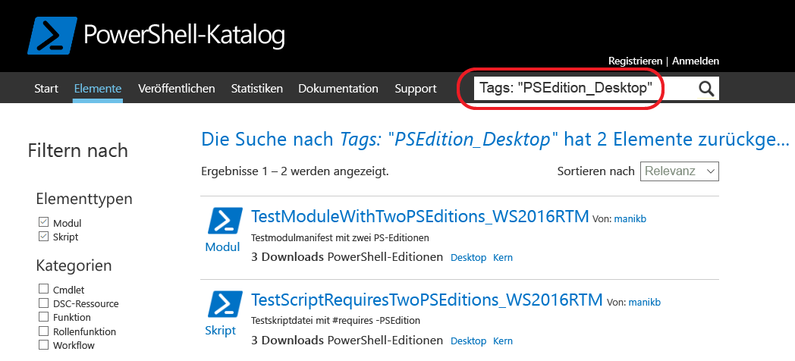

# Elemente mit kompatiblen PowerShell-Editionen
Ab Version 5.1 steht PowerShell in verschiedenen Editionen zur Verfügung, die unterschiedliche Featuregruppen und Plattformkompatibilität bieten.

- **Desktop-Edition:** Diese Edition basiert auf .NET Framework und bietet Kompatibilität mit Skripts und Modulen für Versionen von PowerShell, die unter Vollversionen von Windows wie Server Core und Windows Desktop ausgeführt werden.
- **Core-Edition:** Diese Edition basiert auf .NET Core und bietet Kompatibilität mit Skripts und Modulen für Versionen von PowerShell, die unter funktionsreduzierten Versionen von Windows wie Nano Server und Windows IoT ausgeführt werden.

## Der PowerShell-Katalog extrahiert unterstützte PSEditions-Metadaten und erlaubt Ihnen, die für bestimmte PowerShell-Editionen kompatiblen Elemente zu filtern

Verfügt ein Element über kompatible angegebene PSEditions, werden diese als Teil von „PowerShell Editions“ (PowerShell-Editionen) auf der Seite des Elements und auch in den Elementergebnissen aufgelistet.

## Suchen nach Elementen in der Benutzeroberfläche des Katalogs, die auf PowerShellCore arbeitet
Verwenden Sie die Tags „PSEdition_Desktop“ und „PSEdition_Core“, um die Elemente im PowerShell-Katalog zu filtern.

### Verwenden Sie das Tag „PSEdition_Core“, um Elemente zu suchen, die mit der PowerShell Core-Edition kompatibel sind.

### Verwenden Sie das Tag „PSEdition_Desktop“, um Elemente zu suchen, die mit der PowerShell Desktop Edition kompatibel sind.

## Weitere Informationen zur Erstellung und zum Suchen der Element mit kompatiblen PowerShell-Editionen
### [Module mit PSEditions](../psget/module/modulewithpseditionsupport.md)
### [Skripts in PowerShell-Editionen](../psget/script/scriptwithpseditionsupport.md)

<!--HONumber=Aug16_HO3-->

