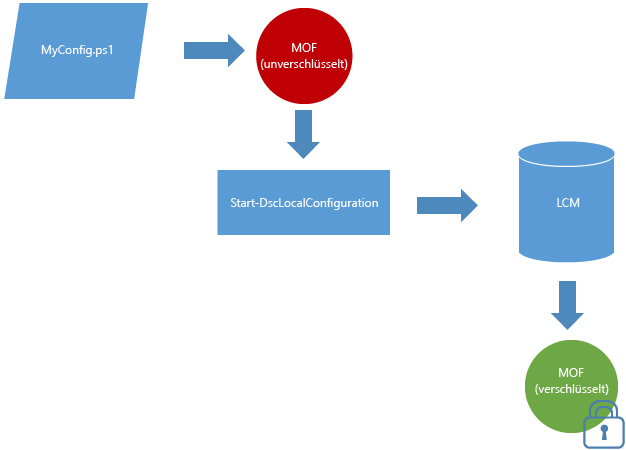

# MOF-Dokumente standardmäßig verschlüsseltMOF Documents Are Encrypted By Default

Konfigurationsdokumente enthalten vertrauliche Informationen.Configuration documents contain sensitive information. In früheren Versionen von DSC mussten Sie zum Schützten von Anmeldeinformationen innerhalb einer Konfiguration Zertifikate verteilen und verwalten.In previous versions of DSC you were required to distribute and manage certificates in order to secure credentials within a configuration. Dies brachte häufig einen erheblichen Verwaltungsaufwand mit sich, wobei es aber immer noch Konfigurationsinformationen gab, die nicht geschützt waren bzw. werden konnten.For many, this was a significant management burden and even with all of the work it took to do this you were still left with some configuration information that was not and could not be secured.

Dies ist nicht mehr der Fall, da **alle MOF-Konfigurationsdateien standardmäßig geschützt sind**.That is no longer the case because **all configuration MOFs are secured by default**. Keine Zertifikate oder Metakonfigurationseinstellungen erforderlichNo certificates or meta-configuration settings are needed. Jedes Mal, wenn eine MOF-Konfigurationsdatei auf einem Zielknoten vom lokalen Konfigurations-Manager (LCM) auf einen Datenträger gespeichert wird, wird sie verschlüsselt.Any time a configuration MOF is saved to disk by the Local Configuration Manager (LCM) on a target node, it is encrypted. Die MOF-Dateien werden mit [DPAPI](https://msdn.microsoft.com/library/ms995355.aspx) verschlüsselt.The MOFs are encrypted using [DPAPI](https://msdn.microsoft.com/library/ms995355.aspx). **Hinweis:** Von einem Konfigurationsskript generierte MOF-Dateien werden nicht verschlüsselt.**Note:** MOFs generated by a configuration script are not encrypted.

**Beispiel:** Verschlüsselung im Pushmodus **Example:** Encryption in push mode 

Wenn Sie bereits die Zertifikatmethode zum Verschlüsseln von Kennwörtern verwenden oder zusätzliche Sicherheit für Ihre Kennwörter benötigen, funktioniert das [bestehende Verfahren zur zertifikatbasierten Verschlüsselung](https://msdn.microsoft.com/powershell/dsc/securemof) weiterhin.If you are already using the certificate method for encrypting passwords or if you need additional security for your passwords, the [existing method of certificate based encryption](https://msdn.microsoft.com/powershell/dsc/securemof) will continue to work. Das Ergebnis ist ein MOF-Dokument, das mit den DPAPIs vollständig verschlüsselt ist und zusätzlich über darin enthaltene verschlüsselte Kennwörter verfügt.The result will be a MOF document that is fully encrypted using the DPAPIs and additionally have passwords encrypted within it.

Diese Verschlüsselung gilt nur für MOF-Konfigurationsdokumente (pending.mof, current.mof, previous.mof, MOF-Teilkonfigurationen).This encryption only applies to configuration MOF documents (pending.mof, current.mof, previous.mof and partial MOFs). MOF-Dateien mit Metakonfigurationen werden weiterhin unverschlüsselt gespeichert, da sie meist keine geheimen Schlüssel enthalten.Meta-configuration MOFs are still saved in plain text since they less likely contain secrets.
