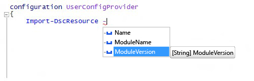

# <a name="import-dscresource-keyword-supports--moduleversion-parameter"></a>Das Schlüsselwort „Import-DscResource“ unterstützt den „-ModuleVersion“-Parameter

Wir haben dem dynamischen Schlüsselwort `Import-DscResource` für das Erstellen von DSC-Konfigurationen einen neuen Parameter hinzugefügt. Ersteller von Konfigurationen können nun genau angeben, aus welcher Modulversion die DSC-Ressourcen geladen werden können. Die neue Syntax des Schlüsselworts lautet:

```powershell
Import-DscResource [-Name <ResourceName(s)>] [-ModuleName <ModuleName(s)>] [-ModuleVersion <ModuleVersion>]
```

* **Name**: Der Name von mindestens einer zu importierenden Ressource.
* **ModuleName**: Modulnamen oder „ModuleSpecification“-Objekte von einem oder mehreren zu importierenden Modulen.
* **ModuleVersion**: Version des zu importierenden Moduls. Falls verwendet, darf „ModuleName“ nur ein Modul darstellen.

In Windows PowerShell ISE wird dessen Name mithilfe von IntelliSense angezeigt:



**Hinweis:**: Der `–ModuleVersion`-Parameter kann nur in Kombination mit dem `–ModuleName`-Parameter verwendet werden. Er kann nicht nur mit dem `–Name`-Parameter mit Ressourcennamen verwendet werden.

Bisher war die einzige Möglichkeit der Angabe der Modulversion beim Laden von DSC-Ressourcen das Verwenden des Spezifikationsobjekts „Module“, z. B.: `–ModuleName @{ModuleName="UserConfigProvider";ModuleVersion="3.0"}`
