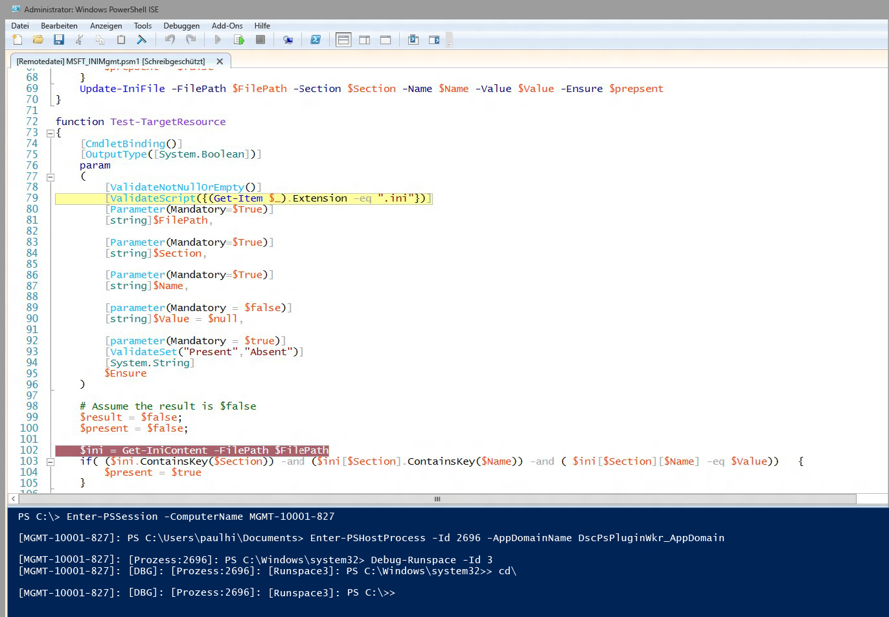

# Debuggen von DSC-Ressourcenskripts
WMF 5.0 Produktion Preview unterstützt das Debuggen von DSC-Ressourcenskripts, während sie auf den Zielknoten ausgeführt werden. In älteren Versionen von WMF 5.0 haben wir erweiterte Features für das Debuggen von Skripts mit der Möglichkeit zum Anfügen an lokale Prozesse (Get-PSHostProcessInfo, Enter-PSHostProcessInfo, Exit-PSHostProcessInfo), zum Auflisten aller Runspaces in einem Prozess und Debuggen eines beliebigen Runspaces in einem Prozess (Get-Runspace, Debug-Runspace) hinzugefügt.

Das Debuggen von DSC-Ressourcenskript baut auf diesem Fundament auf und bietet zwei neue Cmdlets.

##Syntax
**Enable-DscDebug**
Enable-DscDebug \[-BreakAll\] \[-CimSession &lt;CimSession\[\]&gt;\] \[-ThrottleLimit &lt;int&gt;\] \[-AsJob\] \[-WhatIf\] \[-Confirm\] \[&lt;CommonParameters&gt;\]

**Disable-DscDebug**
Disable-DscDebug \[-CimSession &lt;CimSession\[\]&gt;\] \[-ThrottleLimit &lt;int&gt;\] \[-AsJob\] \[-WhatIf\] \[-Confirm\] \[&lt;CommonParameters&gt;\]

##Typischer Workflow


```PowerShell
PS C:\Test> Enable-DscDebug –BreakAll

PS C:\Test> Start-DscConfiguration -path .\TestConfig2 -Wait -Verbose
VERBOSE: Perform operation 'Invoke CimMethod' with following parameters, ''namespaceName' = root/Microsoft/Windows/DesiredStateConfiguration,'className' = MSFT\_DSCLocalConfigurationManager,'methodName' = SendConfigurationApply'.
VERBOSE: An LCM method call arrived from computer MGMT-10001-827 with user sid S-1-5-21-397955417-626881126-188441444-3860663.
VERBOSE: [MGMT-10001-827]: LCM: [ Start Set ]
WARNING: [MGMT-10001-827]: [DSCEngine] Warning LCM is in Debug 'ResourceScriptBreakAll' mode. Resource script processing will be stopped to wait for PowerShell script debugger to attach.
VERBOSE: [MGMT-10001-827]: [DSCEngine] Importing the module C:\WINDOWS\system32\WindowsPowerShell\v1.0\Modules\PSDesiredStateConfiguration\DscResources\MSFT_EnvironmentResource\MSFT_EnvironmentResource.psm1 in force mode.
VERBOSE: [MGMT-10001-827]: LCM: [ Start Resource ] [[Environment]e1]
VERBOSE: [MGMT-10001-827]: LCM: [ Start Test ] [[Environment]e1]
VERBOSE: [MGMT-10001-827]: [[Environment]e1] Importing the module MSFT_EnvironmentResource in force mode.
WARNING: [MGMT-10001-827]: [[Environment]e1] Resource is waiting for PowerShell script debugger to attach. Use the following commands to begin debugging this resource script:
Enter-PSSession -ComputerName MGMT-10001-827 -Credential <credentials>
Enter-PSHostProcess -Id 2640 -AppDomainName DscPsPluginWkr_AppDomain
Debug-Runspace -Id 3

PS C:\Test> Disable-DscDebug
```
Nun wollen wir uns diese Befehle ansehen und prüfen, was ihre Aufgabe ist:

**Enable-DscDebug –BreakAll**
Das Cmdlet „Enable-DscDebug“ mit „BreakAll“ konfiguriert den LCM von DSC für das Ausführen der Skripts „Get-TargetResource“, „Set-TargetResource“ und „Test-TargetResource“ im Modus „Alle unterbrechen“. Dies bedeutet, dass das Skript bei der ersten Skriptanweisung angehalten wird und wartet, bis ein Debugger angefügt wird. Sie können dann über Windows PowerShell-Remoting eine Verbindung mit dem Zielcomputer herstellen und den Windows PowerShell-Debugger an den LCM-Prozess und Runspace anfügen, um das Skript zu debuggen. Im Abschluss können Sie Haltepunkte setzen und das Skript auf die übliche Windows PowerShell-Weise debuggen.

**Start-DscConfiguration -path .\TestConfig2 -Wait -Verbose**

Hiermit wird DSC gestartet, doch da sich der Zielknoten, wie zuvor erwähnt, im Debugmodus befindet, hält es an der ersten DSC-Ressource an, die der LCM ausführt.

Um die Debugsitzung zu starten, führen Sie die Befehle aus, die nach Ausführen von „Start-DscConfiguration“ in der Warnmeldung angezeigt werden. Fügen Sie Ihren clientseitigen Windows PowerShell-Skriptdebugger an den entsprechenden Computer, Prozess, Runspace bzw. die entsprechende Anwendungsdomäne an.

* Führen Sie diesen Befehl aus, um optional über Windows PowerShell-Remoting eine Verbindung mit dem Zielcomputer herzustellen. Überspringen Sie diesen Schritt, wenn bereits eine Remotedesktopverbindung besteht.
```PowerShell
Enter-PSSession -ComputerName MGMT-10001-827
```
* Durch diesen Befehl erfolgt ein Anfügen an den LCM-Hostprozess für DSC und die App-Domäne, in der das Ressourcenskript ausgeführt wird.
```PowerShell
Enter-PSHostProcess -Id 2640 -AppDomainName DscPsPluginWkr\_AppDomain
```
*  Mit dem letzten Befehl können Sie den DSC-Runspace debuggen, der das Skript ausführt.
```PowerShell
Debug-Runspace -Id 3
```


Nachdem Sie den Debugger angefügt haben, setzen Sie in den Zeilen Haltepunkte, in denen Sie die Ausführung des Skripts untersuchen möchten. Führen Sie dann den Debuggerbefehl **continue** aus, um das Skript im Debugger auszuführen. Wenn Sie mit dem Debuggen fertig sind, können Sie die Ausführung des Skript durch Eingabe des Debuggerbefehls **quit** beenden. Sie können auch die Ausführung des Skripts ohne Debugger fortsetzen, indem Sie den Debuggerbefehl **detach** ausführen.

Beachten Sie, dass ***alle*** Ressourcenskripts im Debugger angehalten werden. Dies bedeutet, dass die Skripts „Test-TargetResoruce“, „Set-TargetResource“ und „Get-TargetResource“ nacheinander im Debugger beendet werden. Wenn Sie ein Ressourcenskript nicht debuggen möchten, können Sie den Debugmodus durch Ausführen dieses Befehls im Runspace beenden:

Disable-RunspaceDebug -RunspaceId 3

Oder Sie können den Debugger anfügen, indem Sie erst „Debug-Runspace“ und gleich darauf den **detach**-Befehl ausführen.

Wenn Sie mit dem Debuggen Ihres Ressourcenskripts fertig sind, müssen Sie die DSC-Konfiguration durch Ausführen des folgenden Befehls beenden.

Stop-DscConfiguration –Force

Abschließend müssen Sie den LCM auf dem Zielcomputer so konfigurieren, dass mithilfe des Cmdlets „Disable-DscDebug“ der Debugmodus deaktiviert wird.<!--HONumber=Mar16_HO2-->
